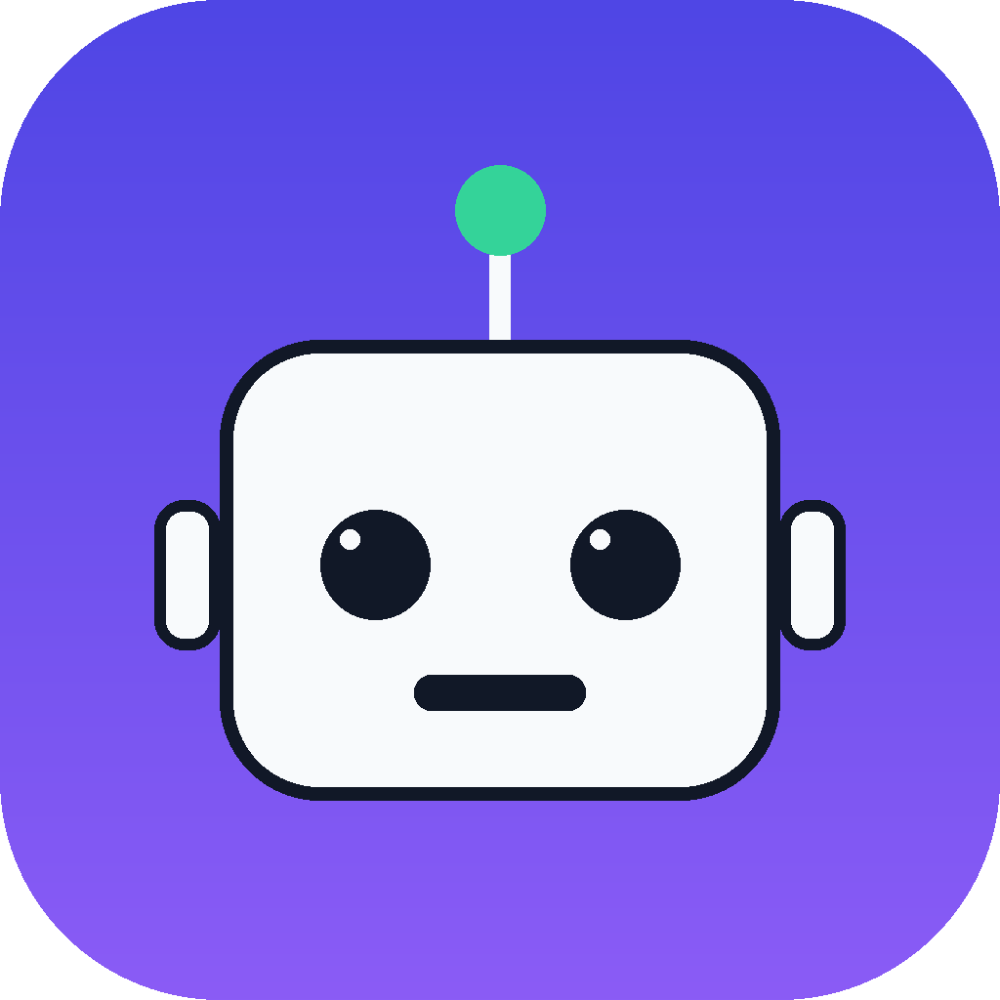

<p align="center">
  
</p>

<h1 align="center">Antigravity Proxy Helper</h1>

<p align="center">
  <b>🚀 专为 Antigravity / Antigravity IDE 打造 —— 无需 TUN、无需全局模式，规则模式下稳定走 Clash Verge</b>
</p>

<p align="center">
  
  
  
  
</p>

<p align="center">
  🇨🇳 中文 | <a href="README_en.md">🇬🇧 English</a>
</p>

---

## ✨ 这是什么？

一个让 **Antigravity / Antigravity IDE** 通过 **Clash Verge** 上网的一键小工具。

> 🎉 **不需要开 TUN，不需要全局模式** —— 保持 Clash 规则模式 + 系统代理即可。
> 🖱️ **傻瓜式一键操作**：运行程序 → 点一次 **🛠️ 初始化 Clash 配置** → 重启 Clash Verge → 打开 Antigravity，完事。

### 为什么以前必须开 TUN？这个工具帮你绕开了

| 流量 | 系统代理 | 说明 |
| --- | --- | --- |
| Antigravity 主界面（Electron） | ✅ 会走 | 正常 |
| 语言服务器 `language_server*.exe`（Go 程序） | ❌ 不走 | 只认 `HTTP_PROXY/HTTPS_PROXY` 环境变量（TUN 之前是唯一办法） |
| 模型请求（Gemini） | — | 出口地区不能是香港/中国大陆/俄罗斯等不支持地区 |

本工具自动把你的**环境变量**、**Antigravity 配置**、**Clash 分流规则**全部配好，所以再也不需要 TUN 和全局。

### 🎁 功能亮点

- 🛠️ **一键初始化 Clash**：自动读取你当前启用的订阅 → **拷贝一份**（不动原订阅）→ 注入进程/域名规则 + `🤖 Antigravity` 代理组（自动筛选**所有支持地区的节点**，剔除香港/俄罗斯等不支持地区）
- 🌐 **自动设置代理**：写入 `HTTP_PROXY` / `HTTPS_PROXY` / `NO_PROXY` 环境变量 + Antigravity `settings.json`，程序启动即生效
- 🧹 **退出自动还原**：关闭程序自动恢复原环境变量（可勾选取消）
- 🔌 **端口可改**：默认 `127.0.0.1:7897`，随时修改、自动保存
- 🌍 **中英双语界面**：右上角一键切换，全英文 Clash 配置也能识别
- ♻️ **安全可重复**：只改副本配置，重复点击不会重复建配置；改动前自动备份

---

## 🚀 三步使用

1. **启动 Clash Verge**（规则模式）
2. 运行 **`AntigravityProxyHelper.exe`** → 点 **🛠️ 初始化 Clash 配置**（**只需第一次**，之后更新订阅可再点一次）
   - 如果 Clash Verge 正在运行，程序会**自动关闭它并在写入后自动重新打开**（避免配置清单被覆盖）
3. 点 **▶ 启动 Antigravity** 或直接打开 Antigravity 开始使用

> 🎯 **只想配置一次、以后不开助手？** 点 **🎯 一次性配置** 按钮：环境变量 + Antigravity 配置 + Clash 配置全部永久生效，关掉程序也不会还原。
> 💡 日常使用：打开 Clash Verge → 打开 Antigravity 即可（不需要每次都开助手）。

---

## 🔘 按钮说明

| 按钮 | 作用 |
| --- | --- |
| 🚀 **立即应用代理** | 把当前地址端口写入环境变量和 Antigravity 配置（程序启动自动执行一次；改端口后点它重新生效） |
| 🎯 **一次性配置** | 永久完成全部配置（环境变量 + Antigravity 设置 + Clash 初始化），**以后无需再运行本工具** |
| 🧹 **还原代理设置** | 完整撤销：恢复环境变量 + 移除 Antigravity `settings.json` 里的 `http.proxy`；关闭程序时若勾选也会自动执行 |
| 🛠️ **初始化 Clash 配置** | 拷贝当前订阅为 `原名 (Antigravity)`，注入规则和代理组并设为当前配置（只需第一次） |
| 🔌 **检测连通性** | 检测 Clash 端口是否可连接 |
| ▶ **启动 ...** | 带代理环境变量启动 Antigravity |

---

## ❓ 常见问题

- **初始化后不生效？** 确认 Clash Verge 里选中的是新配置 `原名 (Antigravity)`；已在运行的 Antigravity 也需重启。
- **初始化要每次都点吗？** 不用，**只需第一次**；之后更换/更新订阅后再点一次即可。
- **关闭程序会还原什么？** 勾选「关闭时还原」→ 还原环境变量 + 移除 Antigravity `settings.json` 里的 `http.proxy`；取消勾选或使用「一次性配置」→ 全部永久保留（`settings.json` 也不动）。
- **为什么初始化会重启我的 Clash Verge？** Clash 运行时内存里保存着配置清单，直接写入可能被它退出时覆盖；程序会自动先关闭 Clash → 安全写入 → 再自动打开。
- **组里为什么没有香港节点？** Gemini 不支持香港地区，已自动过滤。
- **Antigravity 里报 `Agent execution terminated due to error`？** 常见原因是节点长连接中断或 Google 侧问题：先把 🤖 Antigravity 组**换个节点**（推荐日本或其它美国节点）再重试；仍不行则换模型（如 Gemini Flash Medium）、新建对话，或退出账号重新登录。
- **需要管理员权限吗？** 不需要。
- **杀毒软件/SmartScreen 提示？** 未签名 exe 的正常提示，选「仍要运行」即可。
- **初始化做了什么备份？** Clash 的 `profiles.yaml.antigravity.bak`、Antigravity 设置 `settings.json.bak`。

---

## 🧑‍💻 源码运行（可选）

```powershell
pip install pyyaml
python antigravity_proxy_helper.py
```

或双击 `Start Antigravity Proxy Helper.bat`。

依赖：Windows 10/11、Clash Verge Rev（源码运行需 Python 3.10+）。
